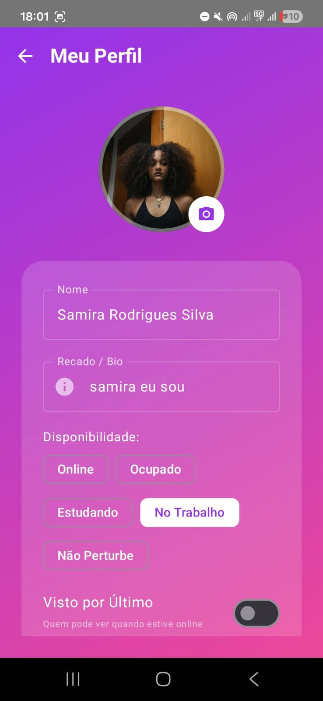
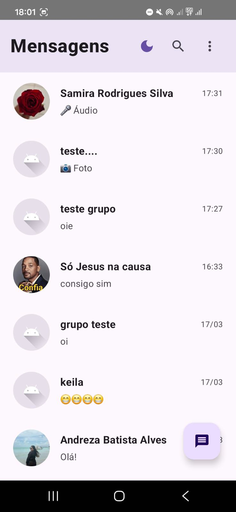
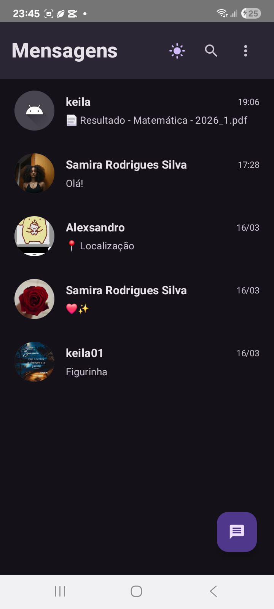
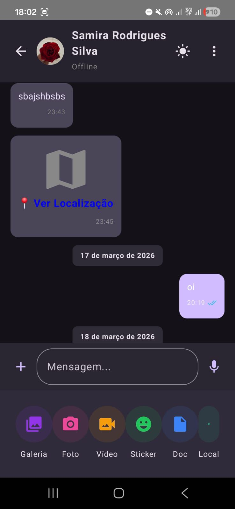

# UNIVERSIDADE FEDERAL DE UBERLANDIA
# SISTEMAS DE INFORMACOES
# PROGRAMACAO PARA DISPOSITIVOS MOVEIS

## Relatorio: Aplicativo de Mensagens Instantaneas

**ANDREZA BATISTA ALVES - 12311BSI246**  
**GIOVANNA VIDA KREMPEL - 12221BSI234**  
**KEILA ALMEIDA SANTANA - 12321BSI213**  
**SAMIRA RODRIGUES SILVA - 12311BSI203**

Uberlandia  
2026

---

## 1 - INTRODUCAO

Este documento apresenta a documentacao completa do **"App de Mensagens"**, um sistema de comunicacao instantanea desenvolvido para a plataforma **Android**. O projeto foi concebido para aplicar conceitos avancados de computacao mobile, incluindo **sincronizacao em tempo real**, **persistencia local para suporte offline**, **seguranca de dados** e integracao com recursos nativos do smartphone. A arquitetura seguiu o padrao **MVVM (Model-View-ViewModel)**, buscando garantir separacao de responsabilidades, reduzindo acoplamento e favorecendo testabilidade e manutencao.

Ao longo do desenvolvimento, o sistema foi estruturado para oferecer uma experiencia de uso semelhante a aplicativos consolidados de mensagens, contemplando mecanismos de persistencia, recuperacao de comunicacoes e integracao com servicos externos para conteudo multimidia.

## 2 - PAPES E DIVISAO DE TAREFAS

A equipe organizou-se conforme o plano de desenvolvimento entregue em 10/03, com as seguintes responsabilidades:

- **Keila Almeida Santana**: atuou no nucleo de comunicacao, desenvolvendo a interface principal do chat (**ChatScreen.kt**), a logica de envio/recebimento de mensagens em tempo real e a configuracao do servico de notificacoes push.

- **Giovanna Vida Krempel**: responsavel pela infraestrutura de dados, modelando o banco local com **Room**, implementando a sincronizacao automatica entre o local e a nuvem e gerenciando logicas de contatos e conversas.

- **Samira Rodrigues Silva**: focou na seguranca e no acesso, desenvolvendo o sistema de autenticacao (**LoginScreen.kt**, **SignUpScreen.kt**), recuperacao de senha e colaborando na identidade visual e no material de apresentacao.

- **Andreza Batista Alves**: atuou como integradora dos modulos, desenvolvendo funcionalidades de alto valor (como mensagens fixadas e filtros), realizando controle de qualidade (testes e correcao de bugs) e redigindo a documentacao tecnica e o relatorio final.

## 3 - DECISOES DE PROJETO E ARQUITETURA TECNICA

As decisoes foram tomadas visando robustez e aderencia aos requisitos do edital. Os principais pontos arquiteturais sao:

- **Sincronizacao Hibrida (Nuvem + Persistencia Local)**: para permitir operacao offline, o app utiliza o **Room Database** como base local. Sempre que ha comunicacao com a nuvem, o conteudo sincronizado e persistido localmente para manter consistencia e reduzir latencia na interface. Em cenarios sem conectividade, as mensagens sao registradas localmente e sincronizadas quando a conexao e restabelecida.

- **Gestao de Midia com Cloudinary**: arquivos de grande volume (como imagens, videos e documentos) nao sao persistidos diretamente no banco de dados. Utiliza-se a API do **Cloudinary** para hospedagem, armazenando na camada de dados apenas referencias (URLs) para acesso posterior, o que melhora desempenho e reduz o tamanho dos dados trafegados.

- **Criptografia de Conteudo**: para atender a criterios de seguranca, foi implementada uma camada de criptografia atraves de **EncryptionUtils.kt**, protegendo o conteudo antes de sua transmissao e persistencia, conforme aplicavel ao tipo de mensagem.

- **Padrao MVVM e Controle de Estado**: a aplicacao utiliza **ViewModels** para coordenar eventos e estado, reduzindo responsabilidades nas Views e melhorando a previsibilidade do fluxo de dados na interface.

## 4 - INTEGRACAO DETALHADA DE SENSORES (GPS, CAMERA E MICROFONE)

O app integra recursos nativos do dispositivo com a experiencia de uso no chat:

- **GPS (Localizacao)**: o usuario aciona uma opcao de envio de localizacao no menu de anexos. O app obtem a localizacao atual e envia uma mensagem especial contendo um link dinamico para visualizacao em mapa. O receptor acessa o ponto compartilhado.

- **Camara (Foto Instantanea)**: o envio de foto e realizado diretamente pela interface do app, utilizando fluxos de captura nativos (**ActivityResultContracts**). A imagem e salva em um diretorio temporario com apoio de **FileProvider**, enviada para hospedagem no Cloudinary e renderizada imediatamente como uma mensagem no chat.

- **Microfone (Mensagens de Voz)**: a gravacao de audio utiliza **MediaRecorder** para capturar audio em um formato adequado para envio. A interface apresenta um controle de gravacao e o app transmite o arquivo resultante como anexo dentro da conversa.

Essas integracoes reforcam o carater multimidia do app e ampliam a usabilidade em contextos reais de comunicacao.

## 5 - PRINCIPAIS DIFICULDADES ENFRENTADAS

- **Persistencia Offline**: o maior desafio tecnico foi garantir que a lista de mensagens nao duplicasse ao sincronizar o cache local com os dados remotos apos longos periodos offline. Esse comportamento exigiu cuidado no controle de insercao e consistencia entre camadas.

- **Permissoes de Hardware**: lidar com o modelo de permissoes do Android (especialmente para localizacao e microfone) exigiu implementacao de fluxos de verificacao em tempo de execucao para evitar falhas e encerramentos inesperados do app.

- **Performance da Interface**: manter a fluidez do scroll em conversas com conteudos pesados (como imagens e documentos) exigiu tratamento eficiente de carregamento e renderizacao. Para isso, foi utilizado carregamento assincrono via bibliotecas de renderizacao de imagem/conteudo.

- **Compatibilidade de Documentos (PDF)**: em alguns cenarios, o app nao conseguia exibir documentos PDF diretamente a partir da URL remota. Para melhorar a compatibilidade com leitores externos, foi implementado um fluxo que baixa o PDF para armazenamento local e abre o arquivo por meio de um Intent com suporte a visualizacao apropriada.

## 6 - CAPTURAS DE TELA

A seguir sao apresentadas capturas de tela do aplicativo, organizadas em uma grade 2x3:

<table>
  <tr>
    <td></td>
    <td></td>
    <td></td>
  </tr>
  <tr>
    <td></td>
    <td></td>
    <td></td>
  </tr>
</table>

## 7 - CONSIDERACOES FINAIS

O aplicativo desenvolvido representa uma solucao completa de comunicacao, integrando funcionalidades essenciais e requisitos especiais solicitados, incluindo mensagens fixadas e filtros. A experiencia de desenvolvimento permitiu ao grupo consolidar conhecimentos sobre arquiteturas de aplicacoes Android, persistencia local, integracao com servicos externos e integracao com hardware do dispositivo.

Como resultado, obteve-se um sistema funcional e estruturado, com evolucoes de qualidade orientadas a usabilidade e robustez da camada de comunicacao e midias.

